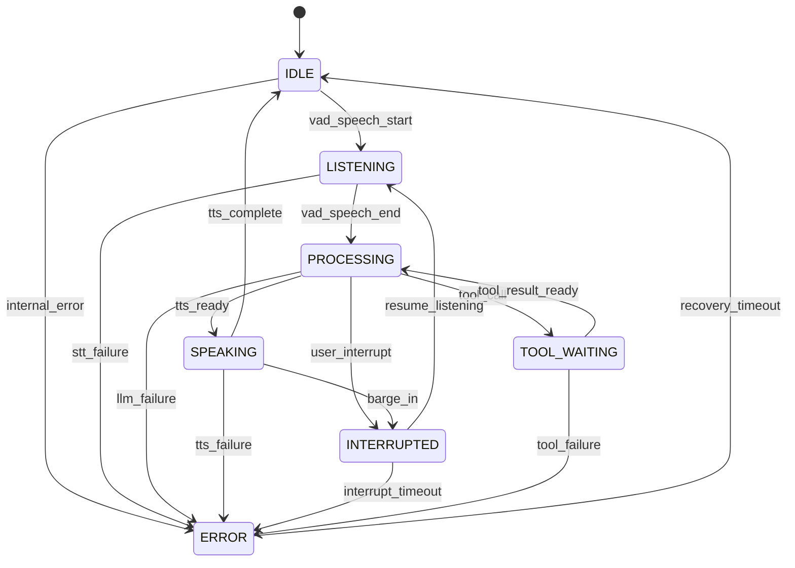

# Orchestrator State Machine

The orchestrator drives the real-time voice pipeline with a formal finite-state
machine (FSM). The enum, transition table, and state sets live in
`shared/src/shared/state.py`; the machine implementation is in
`services/orchestrator/src/orchestrator/core/state_machine.py`; the runtime
behavior (who fires each trigger and under what conditions) is in
`services/orchestrator/src/orchestrator/routes/ws.py` and
`services/orchestrator/src/orchestrator/core/pipeline.py`.

## States (7)

| State | Enum value | Meaning |
|-------|-----------|---------|
| `IDLE` | `"idle"` | No utterance in progress; waiting for VAD to detect speech. |
| `LISTENING` | `"listening"` | Speech is being captured and buffered; VAD actively tracks silence. |
| `PROCESSING` | `"processing"` | STT → LLM running; the user's utterance has ended. |
| `SPEAKING` | `"speaking"` | TTS audio is being synthesized and streamed to the client. |
| `INTERRUPTED` | `"interrupted"` | Barge-in occurred; TTS/LLM was stopped, new speech is buffered. |
| `TOOL_WAITING` | `"tool_waiting"` | Pipeline is awaiting a tool-call result from the tools service. |
| `ERROR` | `"error"` | A pipeline stage failed; waits for recovery (or reconnect). |

Derived state sets (`shared/src/shared/state.py`):

- `AUDIO_INPUT_STATES = {IDLE, LISTENING, INTERRUPTED}` — states in which
  inbound audio is appended to the utterance buffer (`can_accept_audio`).
- `INTERRUPTIBLE_STATES = {SPEAKING, PROCESSING}` — states from which a
  barge-in (`request_barge_in()`) is allowed.

## Transition Table (16)

| # | From | To | Trigger | Conditions |
|---|------|----|---------|------------|
| 1 | `IDLE` | `LISTENING` | `vad_speech_start` | VAD reports `is_speech=True` for an audio chunk while `IDLE` (`ws.py`). |
| 2 | `IDLE` | `ERROR` | `internal_error` | Unhandled internal failure. |
| 3 | `LISTENING` | `PROCESSING` | `vad_speech_end` | VAD silence duration `>= silence_threshold_ms`, or client sends `{"type":"stop"}` while `LISTENING`. |
| 4 | `LISTENING` | `ERROR` | `stt_failure` | STT transcription raises (`pipeline._run_stt`). |
| 5 | `PROCESSING` | `SPEAKING` | `tts_ready` | First sentence chunk synthesized successfully (`pipeline._synthesize_sentence`). |
| 6 | `PROCESSING` | `TOOL_WAITING` | `tool_call` | LLM issues a function/tool call. |
| 7 | `PROCESSING` | `INTERRUPTED` | `user_interrupt` | Barge-in while the LLM is still generating. |
| 8 | `PROCESSING` | `ERROR` | `llm_failure` | LLM generation raises. |
| 9 | `SPEAKING` | `IDLE` | `tts_complete` | All sentences synthesized and streamed; turn ends. |
| 10 | `SPEAKING` | `INTERRUPTED` | `barge_in` | VAD detects speech while TTS is playing (`request_barge_in()`). |
| 11 | `SPEAKING` | `ERROR` | `tts_failure` | TTS synthesis raises. |
| 12 | `INTERRUPTED` | `LISTENING` | `resume_listening` | Barge-in cleanup done (TTs task cancelled, queue drained) — pipeline re-enters listening. |
| 13 | `INTERRUPTED` | `ERROR` | `interrupt_timeout` | Interrupted state not resumed in time. |
| 14 | `TOOL_WAITING` | `PROCESSING` | `tool_result_ready` | Tool result delivered back to the pipeline. |
| 15 | `TOOL_WAITING` | `ERROR` | `tool_failure` | Tool execution fails. |
| 16 | `ERROR` | `IDLE` | `recovery_timeout` | Auto-recovery while `consecutive_errors < 3`; after 3 consecutive errors a client reconnect is required. |

Any other `(source, target)` pair raises `TransitionError` listing the valid
targets for the current source.

## State Diagram

## Error Handling

- Every failure target (`*_failure`, `internal_error`) increments
  `consecutive_errors`; any transition out of `ERROR` resets it.
- `should_auto_recover()` returns `False` once `consecutive_errors >= 3`
  (triple-failure guard, `tests/test_fsm.py`), forcing a client reconnect.
- Transitions are serialized by an internal `asyncio.Lock`; `on_transition`,
  `on_enter`, and `on_exit` callbacks fire within the lock.

## Source of Truth

Do not edit this document independently of the code. The canonical definitions
are:

- `shared/src/shared/state.py` — `FSMState`, `TRANSITIONS`, `AUDIO_INPUT_STATES`, `INTERRUPTIBLE_STATES`
- `services/orchestrator/src/orchestrator/core/state_machine.py` — `StateMachine`, `TransitionError`
- `tests/test_fsm.py` — behavioral spec of the machine
